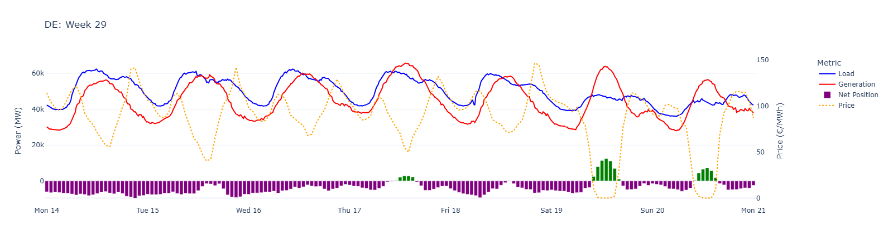
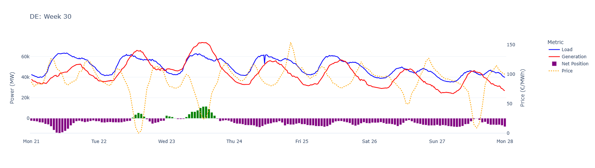
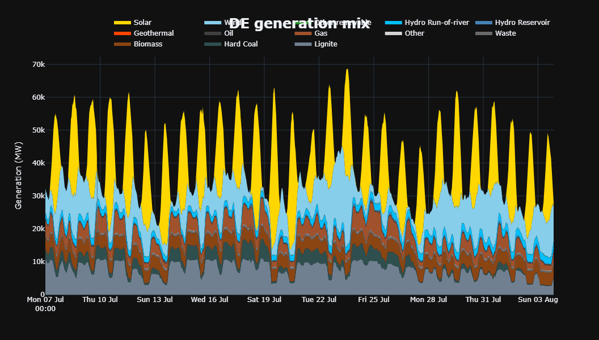
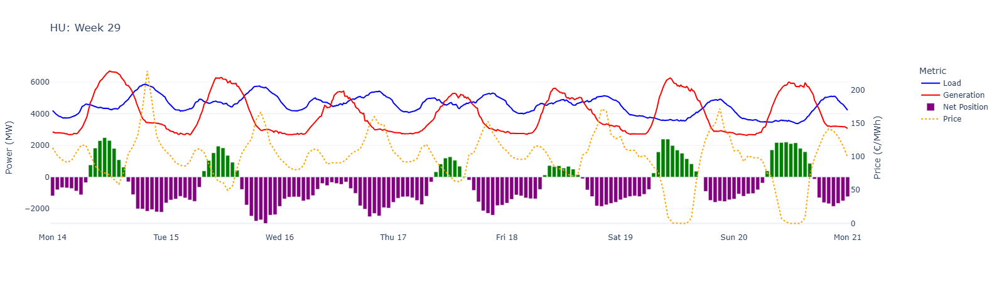
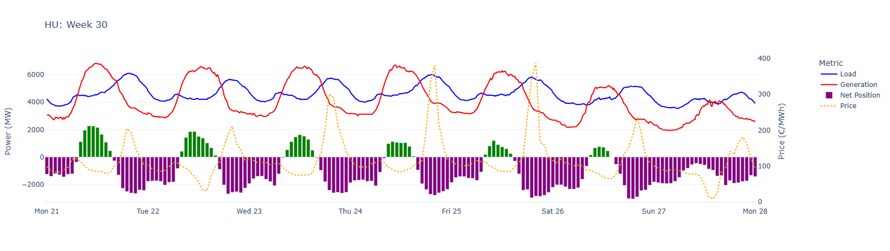
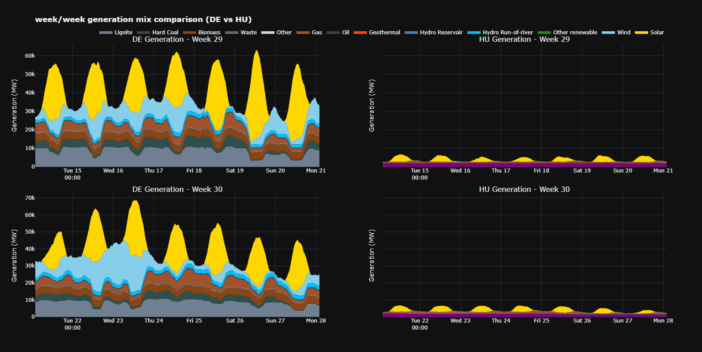
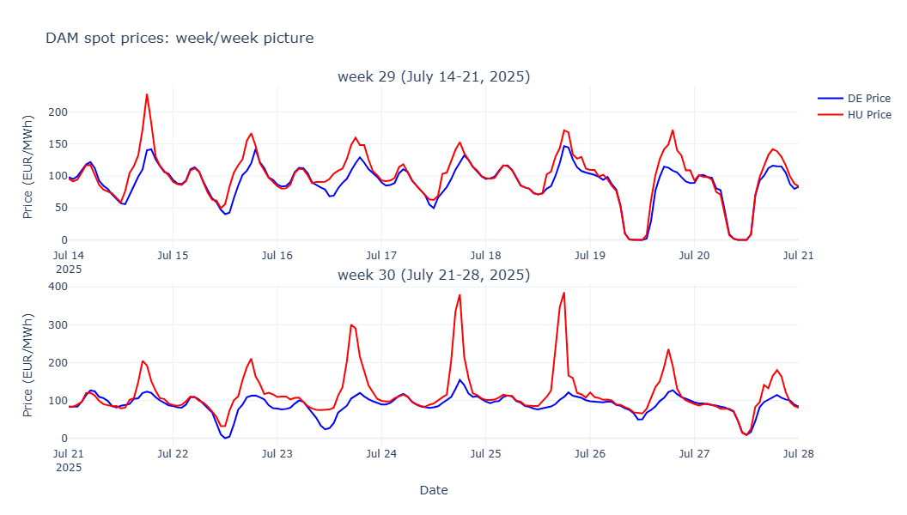
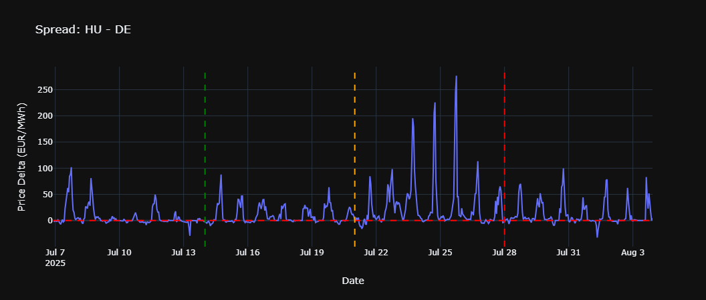
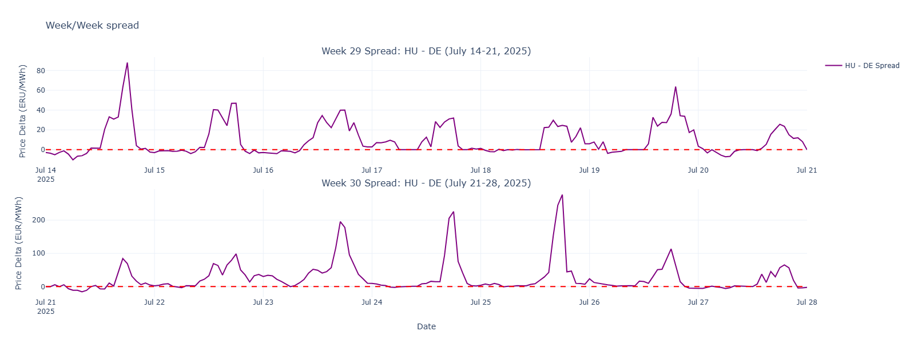
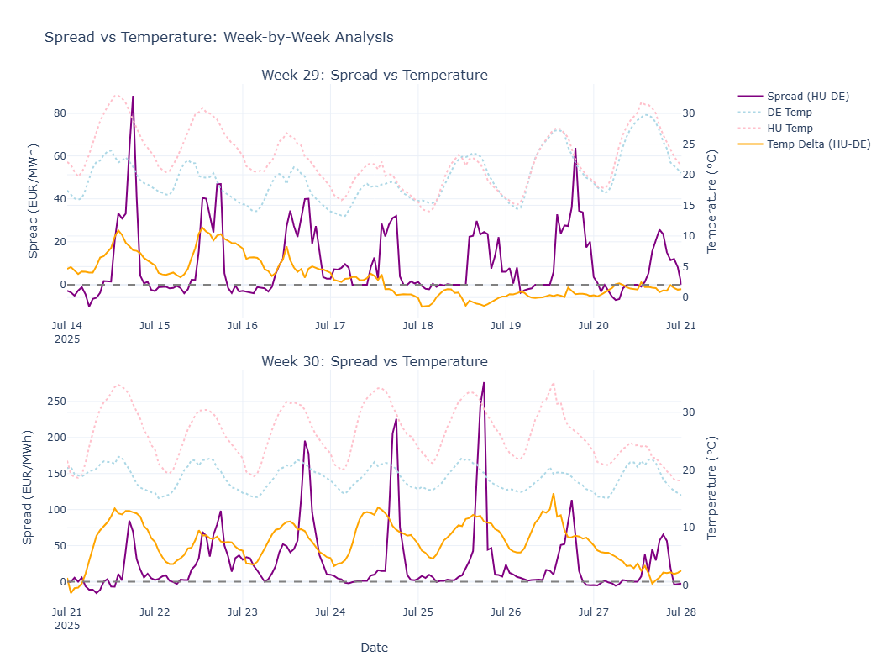

# Power Market Analysis: Germany (DE) vs. Hungary (HU)

## A Comparative Study of Weeks 29 & 30, 2025

> This report provides an analysis of the German (DE) and Hungarian (HU) electricity markets for weeks 29 and 30 of 2025. It focuses on the fundamental drivers of the price spread between the two countries and explains the dramatic increase in volatility in Hungary observed in week 30, driven by regional high temperatures and structural market inefficiencies.

---

### **Part 1: Weekly Comparison of Market Fundamentals**

An analysis of the generation, load, and net positions for both countries reveals their fundamentally different operational profiles.

#### **Germany (DE): A Renewables-Driven Importer**

*Germany's load, generation, net balance, and price for Week 29 & 30.*

**Generation Profile**

> Germany's generation is highly dynamic, driven by a massive fleet of variable renewables. Solar power and wind dictate the daily profile, causing generation to peak significantly during daytime hours. This creates a "merit order effect" where cheap solar and wind power suppress daytime prices. However, this also creates a "solar cliff" in the evening: as solar generation collapses, Germany must rely on imports and its own flexible power plants to meet sustained demand. This evening ramp is a key vulnerability, especially during heatwaves.

---

#### **Hungary (HU): A Baseload-Driven Importer**

*Hungary's load, generation, net balance, and price for Week 29 & 30.*

**Generation Profile**

> Hungary's market design flaws create a "perfect storm" during high-demand periods. Its generation is dominated by inflexible baseload power (like nuclear), which cannot ramp up quickly to meet peak demand. This creates a structural dependency on imports. During a regional heatwave, neighboring countries are also desperate for power, leading to a "load squeeze" where Hungary is forced to pay exorbitant prices for imports. This is exacerbated by physical constraints on cross-border transmission lines, which can become congested, further limiting supply and amplifying price spikes.

---

#### **Generation Mix at a Glance**

*A comparison of the generation mix for Germany and Hungary during weeks 29 and 30.*

> This visual contrasts Germany's massive, solar-dominated (yellow) and wind-influenced (light blue) generation mix with Hungary's much smaller and flatter profile. This difference in generation capacity is the root cause of the diverging market dynamics.

---

### **Part 2: HU-DE Spread Analysis**

The structural differences between the two markets materialize in the price spread `(HU Price - DE Price)`. While Week 29 showed a manageable spread, Week 30 saw an explosion in volatility driven almost entirely by the Hungarian market.

#### **Price & Spread Evolution (Week 29 vs. Week 30)**

*Day-ahead market prices and the HU-DE spread, comparing Week 29 and Week 30.*

- **Week 29**: Hungarian prices were consistently higher than German prices, but the two markets remained broadly coupled. The spread was positive but mostly contained below €80/MWh.
- **Week 30**: The markets decoupled dramatically. While German prices remained relatively stable, Hungarian prices experienced extreme spikes nearing €400/MWh, causing the spread to surge to over €250/MWh.

#### **Drivers of the Price Spikes: A Perfect Storm in Hungary**

The extreme price spikes originate from Hungary's structural vulnerabilities, which were exacerbated by a regional heatwave.

1.  **Structural Import Dependency & Inflexible Generation**: The primary driver is Hungary's inability to meet its own peak demand. The charts show a direct correlation: the highest price spikes occur precisely when Hungary's net position is most negative. Hungary becomes a "price taker," forced to import power at any cost.

2.  **Regional "Load Squeeze"**: During a regional heatwave, Hungary's neighbors face the same crisis. This creates a regional "load squeeze" where multiple countries are competing for scarce power, a key reason why prices in Hungary can spike to levels far beyond those in Western Europe.

3.  **Complex Cross-Border Flows**: Hungary is a critical but vulnerable transit node. While importing heavily from the north and west, it may see reduced import capacity from the south and east due to the regional squeeze. In contrast, Germany can leverage more diverse and resilient partners like France (nuclear) and the Nordic countries (hydro).

*The effect of high average temperatures in Hungary on the price spread.*

---

### **Conclusion**

> The analysis clearly demonstrates that the HU-DE price spread is fundamentally driven by **Hungary's structural dependency on imports** to meet its peak electricity demand. This vulnerability, rooted in its inflexible generation mix and its geographical position, is severely exposed during periods of regional stress, such as a heatwave. Week 30 serves as a clear example of this risk materializing, where manageable price differences escalated into extreme and costly volatility for the Hungarian market.